# Domain-Driven Design - System Bankowy

## Opis zadania
Projekt przedstawia implementację systemu bankowego zgodnie z zasadami Domain-Driven Design. System obsługuje podstawowe operacje bankowe, w tym zarządzanie kontami i realizację przelewów, z zachowaniem odpowiednich reguł biznesowych i bezpieczeństwa. Głównym celem jest stworzenie modularnej i skalowalnej architektury, która odzwierciedla rzeczywiste procesy biznesowe w bankowości.

### Model


# Bounded Contexts w Systemie Bankowym

## 1. Zarządzanie Kontem
### Odpowiedzialności:
- Tworzenie i zamykanie kont bankowych
- Modyfikacja danych konta
- Zarządzanie limitami na koncie
- Obsługa blokad na koncie
- Generowanie wyciągów i historii operacji
- Zarządzanie typami kont (oszczędnościowe, rozliczeniowe, walutowe)

### Kluczowe encje:
- Konto bankowe
- Historia transakcji
- Wyciągi bankowe
- Limity operacji
- Blokady środków

### Główne procesy:
1. Zakładanie nowego konta
2. Modyfikacja parametrów konta
3. Generowanie wyciągów
4. Obsługa blokad środków
5. Zamykanie konta

## 2. Przelewy
### Odpowiedzialności:
- Realizacja przelewów krajowych
- Obsługa przelewów zagranicznych
- Przelewy między własnymi kontami
- Przelewy natychmiastowe
- Przelewy cykliczne/stałe zlecenia
- Zarządzanie szablonami przelewów

### Kluczowe encje:
- Przelew
- Szablon przelewu
- Zlecenie stałe
- Status przelewu
- Historia przelewów

### Główne procesy:
1. Walidacja danych przelewu
2. Sprawdzanie dostępności środków
3. Realizacja przelewu
4. Obsługa zwrotów
5. Zarządzanie zleceniami stałymi

## 3. Uwierzytelnienie
### Odpowiedzialności:
- Zarządzanie danymi logowania
- Autoryzacja operacji
- Zarządzanie metodami autoryzacji
- Obsługa sesji użytkownika
- Zarządzanie uprawnieniami
- Monitorowanie podejrzanych aktywności

### Kluczowe encje:
- Użytkownik
- Sesja
- Metody autoryzacji
- Logi bezpieczeństwa
- Profile uprawnień

### Główne procesy:
1. Uwierzytelnianie użytkownika
2. Autoryzacja operacji bankowych
3. Zarządzanie metodami autoryzacji
4. Monitorowanie aktywności
5. Reset hasła/odblokowanie dostępu

## 4. Zarządzanie Klientem
### Odpowiedzialności:
- Obsługa danych osobowych klientów
- Zarządzanie dokumentami klienta
- Obsługa zgód i oświadczeń
- Zarządzanie produktami klienta
- Obsługa wniosków i reklamacji

### Kluczowe encje:
- Klient
- Dokumenty
- Zgody marketingowe
- Wnioski
- Reklamacje

### Główne procesy:
1. Rejestracja nowego klienta
2. Aktualizacja danych klienta
3. Obsługa reklamacji
4. Zarządzanie zgodami
5. Obsługa wniosków

# Modelowanie Agregatów, Encji i Obiektów Wartości

## 1. Kontekst: Zarządzanie Kontem

### Agregat: KontoBankowe
#### Root: BankAccount
```java
class BankAccount {
    private BankAccountId id;
    private AccountType type;
    private Money balance;
    private AccountStatus status;
    private CustomerId owner;
    private List transactionHistory;
    private List limits;
    private List holds;
}
```

#### Encje:
1. **TransactionHistory**
```java
class TransactionHistory {
    private TransactionId id;
    private TransactionType type;
    private Money amount;
    private LocalDateTime timestamp;
    private String description;
}
```

1. **Hold**
```java
class Hold {
    private HoldId id;
    private Money amount;
    private LocalDateTime expirationDate;
    private HoldType type;
}
```

#### Value Objects:
1. **Money**
```java
class Money {
    private BigDecimal amount;
    private Currency currency;
}
```

1. **AccountLimit**
```java
class AccountLimit {
    private LimitType type;
    private Money dailyLimit;
    private Money monthlyLimit;
}
```

## 2. Kontekst: Przelewy

### Agregat: Przelew
#### Root: Transfer
```java
class Transfer {
    private TransferId id;
    private AccountId sourceAccount;
    private AccountId destinationAccount;
    private Money amount;
    private TransferType type;
    private TransferStatus status;
    private TransferDetails details;
}
```

#### Encje:
1. **RecurringTransfer**
```java
class RecurringTransfer {
    private RecurringTransferId id;
    private TransferTemplate template;
    private RecurrencePattern pattern;
    private LocalDateTime nextExecutionDate;
}
```

#### Value Objects:
1. **TransferTemplate**
```java
class TransferTemplate {
    private String title;
    private String description;
    private AccountNumber recipientAccount;
    private Money amount;
}
```

1. **TransferDetails**
```java
class TransferDetails {
    private String title;
    private String description;
    private LocalDateTime executionDate;
    private String reference;
}
```

## 3. Kontekst: Uwierzytelnienie

### Agregat: UżytkownikSystemu
#### Root: User
```java
class User {
    private UserId id;
    private LoginCredentials credentials;
    private List authMethods;
    private UserStatus status;
    private SecuritySettings settings;
    private List sessions;
}
```

#### Encje:
1. **Session**
```java
class Session {
    private SessionId id;
    private LocalDateTime creationTime;
    private LocalDateTime expirationTime;
    private DeviceInfo deviceInfo;
}
```

#### Value Objects:
1. **LoginCredentials**
```java
class LoginCredentials {
    private String login;
    private HashedPassword password;
    private LocalDateTime lastPasswordChange;
}
```

1. **SecuritySettings**
```java
class SecuritySettings {
    private boolean twoFactorEnabled;
    private List trustedDevices;
    private List allowedIps;
}
```

## 4. Kontekst: Zarządzanie Klientem

### Agregat: Klient
#### Root: Customer
```java
class Customer {
    private CustomerId id;
    private PersonalData personalData;
    private List consents;
    private CustomerStatus status;
    private List products;
}
```

#### Value Objects:
1. **PersonalData**
```java
class PersonalData {
    private String firstName;
    private String lastName;
    private LocalDate dateOfBirth;
    private String pesel;
    private Address address;
    private ContactData contactData;
}
```

2. **Consent**
```java
class Consent {
    private ConsentType type;
    private LocalDateTime givenAt;
    private boolean isActive;
    private String version;
}
```

3. **ContactData**
```java
class ContactData {
    private EmailAddress email;
    private PhoneNumber phone;
    private Address correspondenceAddress;
}
```

## Enumy

```java
enum AccountType { SAVINGS, CHECKING, BUSINESS }
enum AccountStatus { ACTIVE, BLOCKED, CLOSED }
enum TransactionType { DEPOSIT, WITHDRAWAL, TRANSFER }
enum TransferType { DOMESTIC, INTERNATIONAL, INTERNAL }
enum TransferStatus { PENDING, COMPLETED, FAILED, CANCELLED }
enum UserStatus { ACTIVE, BLOCKED, DELETED }
enum CustomerStatus { ACTIVE, SUSPENDED, CLOSED }
enum ConsentType { MARKETING, DATA_PROCESSING, THIRD_PARTY }
```

### Założenia i ograniczenia systemu bankowego

#### Format danych i ograniczenia

| Encja       | Atrybut       | Format        | Opis                              |
|-------------|---------------|---------------|-----------------------------------|
| BankAccount | id            | UUID          | Unikalny identyfikator konta      |
| BankAccount | type          | ENUM          | SAVINGS, CHECKING, BUSINESS       |
| BankAccount | status        | ENUM          | ACTIVE, BLOCKED, CLOSED           |
| BankAccount | openDate      | ISO-8601      | Format: YYYY-MM-DD                |
| BankAccount | balance       | Decimal(15,2) | Max: 999,999,999.99               |
| Customer    | id            | UUID          | Unikalny identyfikator klienta    |
| Customer    | status        | ENUM          | ACTIVE, SUSPENDED, CLOSED         |
| Customer    | customerId    | String(10)    | Format: CUST[0-9]{6}              |
| Customer    | creationDate  | ISO-8601      | Format: YYYY-MM-DD                |
| Transfer    | id            | UUID          | Unikalny identyfikator przelewu   |
| Transfer    | amount        | Decimal(15,2) | Min: 0.01, Max: 100,000.00        |
| Transfer    | type          | ENUM          | DOMESTIC, INTERNATIONAL, INTERNAL |
| Transfer    | status        | ENUM          | PENDING, COMPLETED, FAILED        |
| Transfer    | executionDate | ISO-8601      | Format: YYYY-MM-DDTHH:mm:ss       |

#### Ograniczenia biznesowe

| Obszar         | Ograniczenie           | Wartość                                   |
|----------------|------------------------|-------------------------------------------|
| Konta          | Maksymalna liczba kont | 5 aktywnych kont na klienta               |
| Konta          | Saldo minimalne        | 0.00 PLN (brak debetu)                    |
| Konta          | Dozwolone waluty       | Tylko PLN dla kont oszczędnościowych      |
| Przelewy       | Dzienny limit          | 50,000 PLN dla kont osobistych            |
| Przelewy       | Limit jednorazowy      | 20,000 PLN dla przelewów natychmiastowych |
| Przelewy       | Opłata za express      | 5 PLN                                     |
| Bezpieczeństwo | Wymagania dla hasła    | Min. 8 znaków, duża i mała litera, cyfra  |
| Bezpieczeństwo | Czas sesji             | 15 minut                                  |
| Bezpieczeństwo | Blokada konta          | Po 3 błędnych próbach logowania           |

#### Formaty danych

| Typ          | Format        | Przykład                     |
|--------------|---------------|------------------------------|
| PESEL        | 11 cyfr       | 44051401458                  |
| NIP          | 10 cyfr       | 5261040828                   |
| REGON        | 9 lub 14 cyfr | 012100784                    |
| Nr konta     | IBAN          | PL61109010140000071219812874 |
| Email        | RFC 5322      | jan.kowalski@bank.pl         |
| Telefon      | +XX XXXXXXXXX | +48 123456789                |
| Kod pocztowy | XX-XXX        | 00-001                       |
| Waluta       | ISO 4217      | PLN, EUR, USD                |
| Data         | YYYY-MM-DD    | 2024-11-11                   |
| Czas         | ISO-8601      | 2024-11-11T14:30:00Z         |


### Integracja między kontekstami
1. Zarządzanie Kontem → Przelewy:
    - Weryfikacja stanu konta przed wykonaniem przelewu
    - Aktualizacja salda po wykonaniu przelewu

2. Uwierzytelnienie → Zarządzanie Kontem:
    - Weryfikacja uprawnień do konta
    - Autoryzacja operacji na koncie

3. Przelewy → Zarządzanie Kontem:
    - Pobieranie informacji o koncie
    - Blokada środków podczas przelewu

